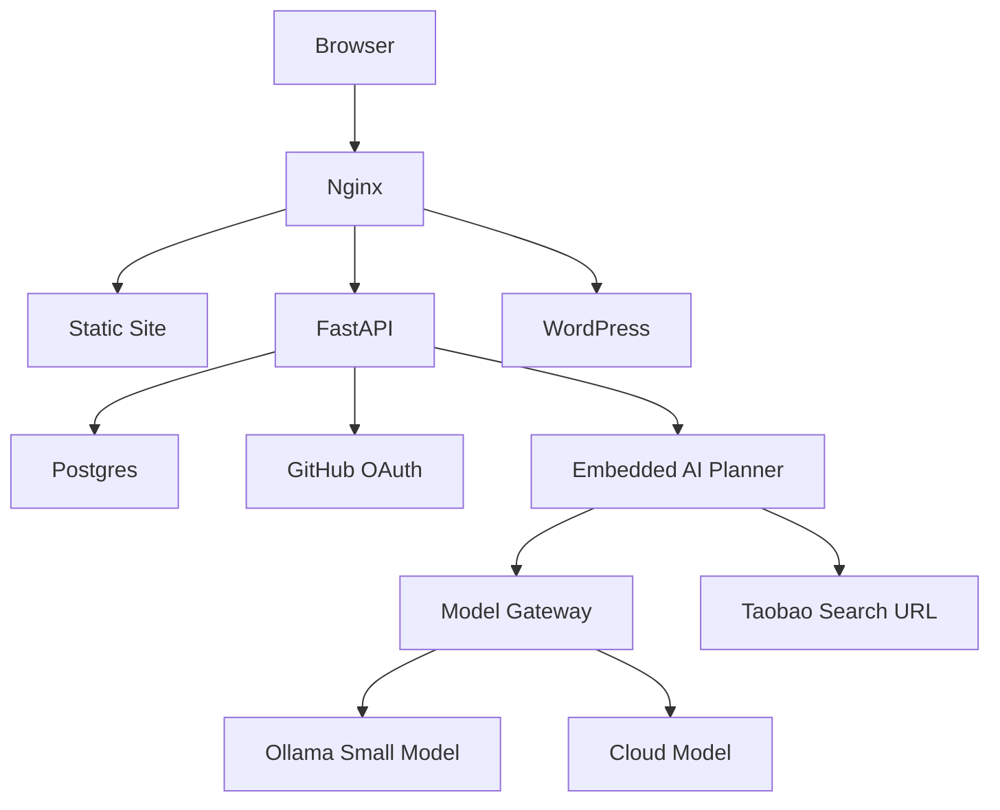

# MVP Architecture

本文定义 `cuizhexiao.xyz` 嵌入式 AI 助手 MVP 的技术架构。目标是先做出能展示、能验证用户需求、能持续迭代的最小闭环。

## 架构原则

- 静态站、博客、业务后端分层清晰。
- FastAPI 只暴露统一 `/api/` 入口。
- 模型服务通过 `Model Gateway` 抽象，不能绑定死在 Ollama。
- 低配 ECS 上优先保证稳定，不把本地大模型作为核心依赖。
- 所有 AI 请求都必须鉴权、计数、审计。

## 组件划分



## 路由

- `/`：静态个人主页和 AI 产品入口。
- `/blog/`：WordPress 博客。
- `/api/`：FastAPI 后端。
- `/admin`：静态管理后台页面，数据来自 `/api/admin/*`。

## FastAPI 模块

```text
backend/
  app/
    main.py
    config.py
    db/
      session.py
      models.py
      migrations/
    auth/
      github.py
      session.py
      dependencies.py
    users/
      service.py
      router.py
    billing/
      quota.py
      subscription.py
      router.py
    ai/
      router.py
      planner.py
      model_gateway.py
      output_schema.py
      taobao.py
    admin/
      router.py
```

## 核心请求流

### 登录

1. 用户点击 GitHub 登录。
2. 前端跳转 `/api/auth/github/login`。
3. GitHub 回调 `/api/auth/github/callback`。
4. FastAPI 创建或更新用户。
5. 如果 GitHub username 为 `TonyDDcui`，设置 `role=admin`。
6. 写入 refresh token hash，设置 HttpOnly Cookie。
7. 前端调用 `/api/me` 获取用户态。

### AI 方案生成

1. 用户提交自然语言需求。
2. FastAPI 校验登录状态。
3. 查询用户订阅和每日额度。
4. 判断回答模式：`teaching`、`delivery` 或 `auto`。
5. 识别场景：蓝桥杯单片机组、电子设计竞赛、智能车或通用项目。
6. 识别主控：STM32、ESP32、NXP RT1064。
7. 生成模型提示词和结构化输出要求。
8. 调用 `Model Gateway`。
9. 补全淘宝搜索链接。
10. 记录 `ai_requests`。
11. 返回结构化方案。

## Model Gateway

`Model Gateway` 是模型供应商抽象层，统一输入输出。

### MVP Provider

- `ollama`：本地 Demo，小模型，适合展示低成本部署。
- `openai_compatible`：外部模型服务，适合代码生成和复杂推理。

### 配置

```env
MODEL_PROVIDER=ollama
OLLAMA_BASE_URL=http://ollama:11434/v1
OLLAMA_MODEL=qwen2.5:1.5b
OPENAI_COMPATIBLE_BASE_URL=https://example.com/v1
OPENAI_COMPATIBLE_API_KEY=change_me
OPENAI_COMPATIBLE_MODEL=change_me
```

## 数据模型边界

MVP 必须有：

- `users`
- `identities`
- `refresh_tokens`
- `subscriptions`
- `usage_daily`
- `ai_requests`
- `contest_test_cases`

后续再加：

- `hardware_products`
- `usage_events`
- `blog_ai_tasks`

## 部署建议

当前 ECS 规格为 `2 核 2G + 4G swap + 3M`：

- Nginx 运行在主机。
- FastAPI、Postgres、WordPress、MySQL 通过 Docker Compose 管理。
- Ollama 可选启动，不作为强依赖。
- 如果内存紧张，优先停用 Ollama，改为外部模型服务。
- Postgres 和 MySQL 内存参数要保守。

## MVP 验收

- `/api/me` 未登录返回未认证，登录后返回用户信息。
- GitHub 登录能创建用户。
- 管理员能被识别为 `admin`。
- 普通用户每天免费 5 次 AI 请求。
- 超额后返回 `SUBSCRIPTION_REQUIRED`。
- `POST /api/ai/embedded/project-plan` 返回结构化方案。
- AI 请求被写入 `ai_requests`。
