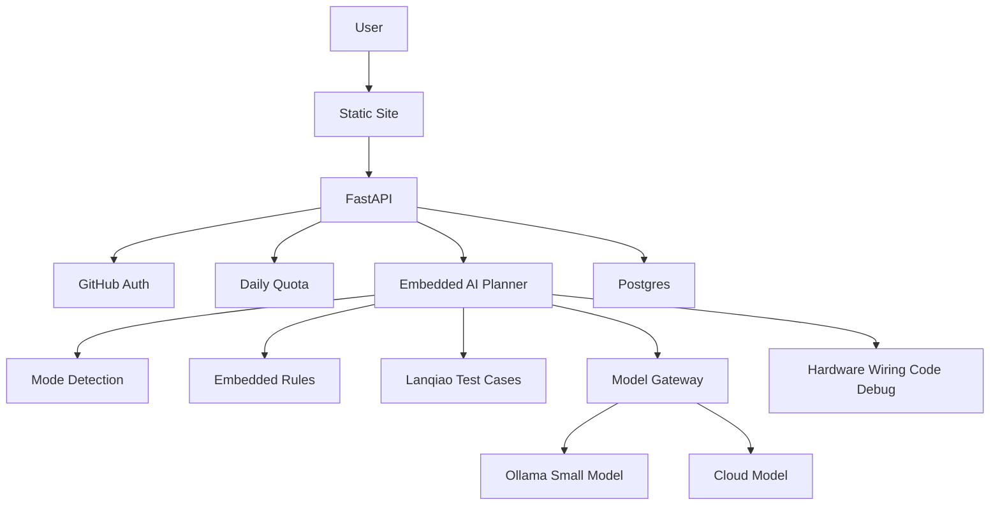

# cuizhexiao.xyz 嵌入式 AI 助手项目计划书

## 1. 一句话定位

`cuizhexiao.xyz` 第一阶段是个人作品集和技术展示站，第二阶段演进为面向大学生、嵌入式初学者和电子竞赛人群的嵌入式 AI 项目落地助手。

产品不做泛聊天，核心价值是帮助用户把自然语言需求转成可执行的嵌入式项目方案：硬件选型、淘宝搜索链接、接线说明、电路注意事项、代码骨架和调试步骤。

## 2. 可行性结论

项目可以落地，但 MVP 必须聚焦。第一阶段不应追求训练一个强大的本地模型，而应做成“AI 编排层 + 嵌入式知识模板 + 蓝桥杯测试集 + 可切换模型网关”。

当前 ECS 为 `2 核 2G + 4G swap + 3M 带宽`，适合承载静态站、FastAPI、Postgres、小规模 WordPress 和轻量模型 Demo，不适合承担高质量代码生成的大模型推理。因此模型层必须抽象，允许在 Ollama 小模型、云端模型和后续更强服务器之间切换。

## 3. 外部趋势判断

- 边缘 AI 和 MCU AI 正在升温。ST、NXP、Infineon 等厂商持续推进 MCU 端 AI、TinyML、NPU 和安全 MCU。
- STM32 生态适合冷启动。STM32Cube.AI、ST Edge AI Developer Cloud、STM32 Model Zoo 等工具说明 STM32 AI 已经有明确工具链。
- AI 教育和项目式学习正在加速。自然语言生成代码、智能硬件教学、AI 编程课程正在被学校和培训机构接受。
- 蓝桥杯、电子设计竞赛、智能车是天然测试场。它们有明确题目、明确评测标准、强结果导向，适合建立案例库和评测集。
- 学生愿意为“做出项目成果”付费，而不是为普通聊天付费。商业价值应围绕竞赛、课程设计、毕业设计和作品展示。

## 4. 目标用户

- 大学生：准备蓝桥杯、电子设计竞赛、智能车、课程设计和毕业设计。
- 嵌入式初学者：缺少硬件选型、接线、外设驱动和调试经验。
- 非嵌入式背景用户：需要快速把电子类项目落地。
- 未来合作方：硬件商家、竞赛培训内容方、课程/项目辅导场景。

## 5. MVP 范围

第一阶段只做能展示、能验证需求的闭环：

1. GitHub 登录和管理员识别。
2. 每日免费 5 次 AI 调用。
3. 嵌入式项目方案生成接口。
4. `teaching` 教学模式和 `delivery` 落地模式。
5. STM32、ESP32、NXP RT1064 三类主控支持。
6. STM32 第一版优先标准库，ESP32 优先 Arduino for ESP32，NXP RT1064 优先 MCUXpresso SDK。
7. AI 根据硬件名称生成淘宝搜索链接。
8. 蓝桥杯单片机组 `.doc` 题目作为第一批测试集。
9. 管理员后台查看用户、用量、AI 请求和测试结果。

## 6. 产品工作流



## 7. 结构化输出

AI 输出必须结构化，避免只给泛泛建议：

```json
{
  "mode": "teaching | delivery",
  "scenario": "lanqiao_mcu | electronic_design | smart_car | general",
  "mcu_family": "STM32 | ESP32 | NXP_RT1064",
  "summary": "项目方案摘要",
  "hardware_plan": [],
  "purchase_links": [
    {
      "source": "taobao",
      "keyword": "模块搜索关键词",
      "url": "https://s.taobao.com/search?q=..."
    }
  ],
  "wiring_plan": [],
  "circuit_notes": [],
  "code": [],
  "debug_steps": [],
  "risks": []
}
```

## 8. 评测方法

第一批评测集来自蓝桥杯官网 `.doc` 题目。

每道题需要提取：

- 年份、级别、省赛/国赛
- 题目原文
- 外设要求
- 关键能力点：定时器、数码管、按键、串口、ADC、PWM、EEPROM 等
- 预期输出能力：硬件方案、代码骨架、调试建议

评分维度：

- 可落地性
- 硬件完整性
- 接线正确性
- 代码可用性
- 调试价值
- 教学清晰度

## 9. 商业化路径

第一阶段先做展示和验证，不接真实支付。

第二阶段做象征性订阅，控制每日调用次数。

第三阶段再做商业化：

- 蓝桥杯单片机组专项训练包
- 课程设计/毕业设计项目落地包
- 电子设计竞赛和智能车训练包
- 高质量代码生成和调试服务
- 硬件商家合作商品推荐

## 10. 关键风险

- 模型幻觉会造成接线错误或代码不可用，必须通过模板、规则、测试集和人工标注降低风险。
- 低配 ECS 不适合本地强模型推理，必须使用可切换模型网关。
- 竞赛辅助不能宣传为代做或作弊工具，产品定位应是教学、训练、方案辅助和调试助手。
- 淘宝链接第一版只生成搜索链接，不承诺具体商品质量、价格和库存。
- WordPress、FastAPI、Postgres、Ollama 同机部署时要控制内存占用。

## 11. 90 天路线图

### 第 1-2 周：安全与部署基线

- 增加 `.gitignore`
- 移出 ECS 密码、SSL 私钥、`.env`
- 梳理 Nginx 路由
- 保证 `/`、`/api/`、`/blog/` 路径规划清晰

### 第 3-4 周：后端闭环

- FastAPI 骨架
- Postgres 数据模型
- GitHub OAuth
- 用户、会话、每日用量
- 管理员识别

### 第 5-6 周：AI 方案生成

- 嵌入式 AI Planner
- 模型网关
- 教学/落地模式判断
- 淘宝搜索链接生成
- STM32 标准库输出

### 第 7-8 周：蓝桥杯测试集

- 下载并整理蓝桥杯 `.doc` 题目
- 建立题目导入格式
- 标注外设和能力点
- 建立评分表

### 第 9-10 周：多主控支持

- ESP32 Arduino 示例输出
- NXP RT1064 MCUXpresso SDK 示例输出
- 调试助手
- AI 请求审计

### 第 11-12 周：展示与运营

- 静态站嵌入 AI 入口
- 结果页展示硬件、接线、代码和调试
- 管理后台最小版
- 准备 3 个演示案例

## 12. 成功标准

- 用户能用 GitHub 登录。
- 输入蓝桥杯单片机组题目后，系统能给出可读、可执行、可调试的方案。
- STM32、ESP32、NXP RT1064 各有一个演示案例。
- 管理员能查看用户、用量和 AI 请求。
- 站点能作为个人作品集展示你的产品、嵌入式能力和 AI 工程能力。
